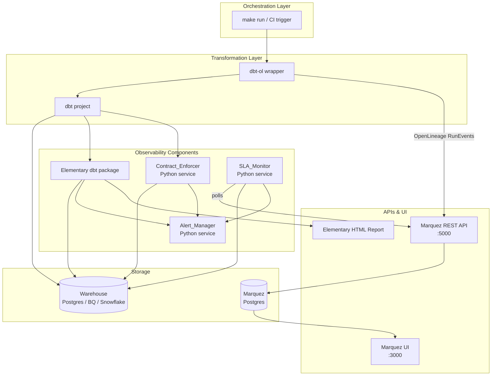

# Design Document

## Data Observability Platform

---

## Overview

The Data Observability Platform is a portfolio-grade, end-to-end observability system for modern dbt-based data pipelines. It layers five observability capabilities on top of an existing dbt + SQL warehouse stack:

1. **Data Lineage** — OpenLineage events emitted via `dbt-ol`, stored and queryable in Marquez.
2. **Data Quality** — dbt-native and Elementary tests run after every model materialisation.
3. **Anomaly Detection** — Elementary statistical monitors track row counts, null rates, and distinct value counts.
4. **SLA & Freshness Monitoring** — A Python `SLA_Monitor` service polls Marquez lineage events and evaluates freshness against declared SLA windows.
5. **Data Contract Enforcement** — A Python `Contract_Enforcer` validates materialised dataset schemas against YAML-declared contracts.

All components are wired together through a shared `.env` configuration, deployed via Docker Compose, and surfaced through the Elementary HTML report and the Marquez UI.

### Key Technology Choices

| Concern | Technology | Rationale |
|---|---|---|
| Lineage emission | `openlineage-dbt` (`dbt-ol`) | Drop-in dbt wrapper; reads `manifest.json`, `run_results.json`, `catalog.json` post-run |
| Lineage storage | Marquez (Docker) | Reference OpenLineage backend; REST API for upstream/downstream queries |
| Quality & anomaly | Elementary (`dbt-data-reliability`) | dbt-native package; stores results in warehouse; generates HTML report |
| Contract validation | Python + Pydantic + PyYAML | YAML contracts parsed and validated against warehouse information schema |
| SLA monitoring | Python APScheduler service | Polls Marquez API on configurable interval; writes status to Postgres |
| Alerting | Python `httpx` + SMTP | Slack webhook and email delivery with retry logic |
| Dashboard | Elementary report + Marquez UI | Served as static HTML and Docker service respectively |
| Warehouse | Postgres (default), BigQuery, Snowflake | dbt profiles.yml selects adapter via env var |
| Deployment | Docker Compose + Makefile | Single-command bootstrap for local development |

---

## Architecture



### Data Flow Summary

1. `make run` invokes `dbt-ol run` which executes dbt models against the Warehouse.
2. After the run, `dbt-ol` reads dbt artifacts and emits OpenLineage `RunEvent` objects to the Marquez HTTP API.
3. Elementary tests (embedded in the dbt project) execute as part of `dbt test`, writing results to the `elementary` schema in the Warehouse.
4. The `Contract_Enforcer` reads YAML contract files and queries the Warehouse information schema to detect violations.
5. The `SLA_Monitor` polls Marquez on a schedule, computes freshness states, and writes them to a `sla_status` table.
6. The `Alert_Manager` is invoked by the Quality_Engine, Contract_Enforcer, and SLA_Monitor to deliver notifications.
7. `edr report generate` produces the Elementary HTML report from Warehouse data.

---

## Components and Interfaces

### 1. Lineage_Tracker (`dbt-ol` + Marquez)

The `dbt-ol` CLI wrapper is the lineage emission mechanism. It is a thin Python wrapper around `dbt` that reads the three dbt artifact files after a run and constructs OpenLineage events.

**Configuration (environment variables):**
```
OPENLINEAGE_URL=http://marquez:5000
OPENLINEAGE_NAMESPACE=data_observability_platform
```

**Marquez REST API endpoints used:**

| Operation | Endpoint |
|---|---|
| Receive lineage event | `POST /api/v1/lineage` |
| Get upstream datasets | `GET /api/v1/lineage?nodeId=dataset:{ns}:{name}&depth={n}` |
| Get downstream datasets | `GET /api/v1/lineage?nodeId=dataset:{ns}:{name}&depth={n}` |
| List dataset runs | `GET /api/v1/namespaces/{ns}/datasets/{name}/versions` |

**Retry logic** for Marquez delivery is handled by the `openlineage-python` client, which supports configurable retry count and backoff. The platform sets `OPENLINEAGE_TRANSPORT_RETRY_ATTEMPTS=3` and `OPENLINEAGE_TRANSPORT_RETRY_BACKOFF=2` (exponential).

**Column-level lineage** is emitted automatically by `dbt-ol` when `catalog.json` is present (generated by `dbt docs generate`). The `ColumnLineageDatasetFacet` maps output columns to their source columns and transformation type.

---

### 2. Quality_Engine (dbt + Elementary)

Elementary is installed as a dbt package (`packages.yml`) and initialised with `dbt run --select elementary`. It creates a dedicated `elementary` schema in the Warehouse containing test result tables.

**Elementary test types supported:**

| Test | Elementary name |
|---|---|
| Row count threshold | `elementary.volume_anomalies` |
| Null rate | `elementary.null_count_anomalies` |
| Distinct count | `elementary.dimension_anomalies` |
| Not-null | dbt native `not_null` |
| Uniqueness | dbt native `unique` |
| Accepted values | dbt native `accepted_values` |
| Referential integrity | dbt native `relationships` |
| Custom SQL | dbt native `dbt_utils.expression_is_true` |

**Key tables written to Warehouse:**

| Table | Contents |
|---|---|
| `elementary.dbt_test_results` | Per-test pass/fail/warn with model, test name, failure count, timestamp |
| `elementary.dbt_run_results` | Per-model run metadata |
| `elementary.data_monitoring_metrics` | Time-series metric values for anomaly detection |
| `elementary.anomalies_source_freshness` | Freshness check results |

**Untested model warning** is implemented via a dbt `on-run-end` hook that queries `elementary.dbt_models` for models with no associated tests and logs a warning.

---

### 3. SLA_Monitor (Python service)

A standalone Python service using `APScheduler` that runs on a configurable interval (default: every 60 minutes).

**Interface:**

```python
class SLAMonitor:
    def evaluate_all(self) -> list[FreshnessStatus]
    def get_status(self, dataset_name: str) -> FreshnessStatus
    def get_all_statuses(self) -> list[FreshnessStatus]
```

**Freshness evaluation logic:**
1. Query Marquez `GET /api/v1/namespaces/{ns}/datasets/{name}/versions` for the latest run timestamp.
2. If no runs exist → `UNKNOWN`.
3. Compute `elapsed = now - last_successful_run_time`.
4. If `elapsed > sla_window` → `SLA_BREACHED`.
5. If `elapsed > sla_window * warning_threshold` (default 0.8) → `WARNING`.
6. Otherwise → `FRESH`.

**HTTP endpoint** (FastAPI, port 8080):
```
GET /freshness          → list[FreshnessStatus]
GET /freshness/{name}   → FreshnessStatus
```

---

### 4. Contract_Enforcer (Python service)

Reads YAML contract files from `contracts/` directory and validates them against the Warehouse information schema after each dbt run.

**Contract YAML schema:**
```yaml
dataset: orders
columns:
  - name: order_id
    type: INTEGER
    nullable: false
    unique: true
  - name: customer_id
    type: INTEGER
    nullable: false
freshness_sla: 3600   # seconds
```

**Interface:**

```python
class ContractEnforcer:
    def load_contracts(self, contracts_dir: Path) -> list[DataContract]
    def validate(self, contract: DataContract) -> list[ContractViolation]
    def validate_all(self) -> ContractComplianceReport
```

**Violation types:**

| Type | Condition |
|---|---|
| `MISSING_COLUMN` | Column in contract absent from warehouse schema |
| `TYPE_MISMATCH` | Column type differs from declared type |
| `NULLABILITY_VIOLATION` | Non-nullable column contains null values |

---

### 5. Alert_Manager (Python service)

Receives violation/anomaly/SLA breach events and delivers notifications via Slack webhook or SMTP email.

**Interface:**

```python
class AlertManager:
    def send_quality_alert(self, failure: TestFailure) -> None
    def send_anomaly_alert(self, anomaly: Anomaly) -> None
    def send_sla_alert(self, breach: SLABreach) -> None
    def send_contract_alert(self, violation: ContractViolation) -> None
```

**Delivery logic:**
- Checks suppression window (default 4 hours) before sending.
- Retries up to 3 times with exponential backoff on delivery failure.
- Logs delivery failures to `alert_delivery_failures` table.

**Channels configured via `.env`:**
```
ALERT_CHANNEL=slack          # slack | email | both
SLACK_WEBHOOK_URL=https://...
SMTP_HOST=smtp.example.com
SMTP_PORT=587
ALERT_EMAIL_TO=team@example.com
ALERT_SUPPRESSION_WINDOW_HOURS=4
```

---

### 6. Observability_Dashboard

Two complementary UIs:

| UI | Technology | Port | Purpose |
|---|---|---|---|
| Elementary Report | Static HTML (edr) | served via nginx:8081 | Quality results, anomaly history, freshness |
| Marquez UI | React app (Docker) | 3000 | Lineage DAG, dataset detail |

The Elementary report is regenerated after each dbt run via `edr report generate`. The Marquez UI reads live from the Marquez API.

---

## Data Models

### FreshnessStatus

```python
@dataclass
class FreshnessStatus:
    dataset_name: str
    namespace: str
    state: Literal["FRESH", "WARNING", "SLA_BREACHED", "UNKNOWN"]
    last_run_time: datetime | None
    elapsed_seconds: float | None
    sla_seconds: float
    warning_threshold: float          # fraction of sla_seconds (default 0.8)
    breach_time: datetime | None
    recovery_time: datetime | None
    breach_duration_seconds: float | None
```

### DataContract

```python
class ColumnContract(BaseModel):
    name: str
    type: str
    nullable: bool = True
    unique: bool = False

class DataContract(BaseModel):
    dataset: str
    columns: list[ColumnContract]
    freshness_sla: int | None = None   # seconds
```

### ContractViolation

```python
@dataclass
class ContractViolation:
    dataset_name: str
    violation_type: Literal["MISSING_COLUMN", "TYPE_MISMATCH", "NULLABILITY_VIOLATION"]
    column_name: str
    expected: str | None
    observed: str | None
    null_count: int | None
    run_timestamp: datetime
```

### Anomaly

```python
@dataclass
class Anomaly:
    table_name: str
    column_name: str | None
    metric_name: str                   # row_count | null_rate | distinct_count
    observed_value: float
    expected_min: float
    expected_max: float
    std_deviations: float
    detection_timestamp: datetime
```

### OpenLineage RunEvent (emitted structure)

```json
{
  "eventType": "COMPLETE",
  "eventTime": "2024-01-15T10:30:00Z",
  "run": {
    "runId": "<uuid>",
    "facets": {
      "errorMessage": { ... }
    }
  },
  "job": {
    "namespace": "data_observability_platform",
    "name": "dbt.orders"
  },
  "inputs": [
    {
      "namespace": "data_observability_platform",
      "name": "raw.orders",
      "facets": {
        "columnLineage": {
          "fields": {
            "order_id": { "inputFields": [{ "namespace": "...", "name": "raw.orders", "field": "id" }] }
          }
        }
      }
    }
  ],
  "outputs": [{ "namespace": "data_observability_platform", "name": "marts.orders" }]
}
```

### SLA Configuration (YAML)

```yaml
# sla_config.yml
datasets:
  - name: marts.orders
    freshness_sla: 3600        # 1 hour
    warning_threshold: 0.8
  - name: marts.customers
    freshness_sla: 86400       # 24 hours
    warning_threshold: 0.75
```

### Warehouse Schema for Platform Tables

```sql
-- Written by SLA_Monitor
CREATE TABLE observability.sla_status (
    dataset_name     TEXT NOT NULL,
    namespace        TEXT NOT NULL,
    state            TEXT NOT NULL,
    last_run_time    TIMESTAMPTZ,
    elapsed_seconds  FLOAT,
    sla_seconds      FLOAT NOT NULL,
    evaluated_at     TIMESTAMPTZ NOT NULL DEFAULT NOW(),
    PRIMARY KEY (dataset_name, namespace)
);

-- Written by Contract_Enforcer
CREATE TABLE observability.contract_violations (
    id               SERIAL PRIMARY KEY,
    dataset_name     TEXT NOT NULL,
    violation_type   TEXT NOT NULL,
    column_name      TEXT,
    expected         TEXT,
    observed         TEXT,
    null_count       INTEGER,
    run_timestamp    TIMESTAMPTZ NOT NULL
);

-- Written by Alert_Manager
CREATE TABLE observability.alert_delivery_failures (
    id               SERIAL PRIMARY KEY,
    alert_type       TEXT NOT NULL,
    payload          JSONB NOT NULL,
    attempts         INTEGER NOT NULL,
    last_attempt_at  TIMESTAMPTZ NOT NULL
);
```

---

## Correctness Properties

*A property is a characteristic or behavior that should hold true across all valid executions of a system — essentially, a formal statement about what the system should do. Properties serve as the bridge between human-readable specifications and machine-verifiable correctness guarantees.*

### Property 1: Lineage event round-trip

*For any* valid dbt run result (job name, run ID, input datasets, output datasets, run state), serialising it as an OpenLineage `RunEvent` and delivering it to Marquez, then querying Marquez for that dataset's lineage, SHALL return a graph that contains the emitted job as a node connected to the declared input and output datasets.

**Validates: Requirements 1.1, 1.2, 2.1, 2.2, 2.3**

---

### Property 2: Freshness state monotonicity

*For any* dataset with a configured `Freshness_SLA`, if the elapsed time since last successful load is `t`, then:
- `t ≤ sla * warning_threshold` → state is `FRESH`
- `sla * warning_threshold < t ≤ sla` → state is `WARNING`
- `t > sla` → state is `SLA_BREACHED`

These three regions are mutually exclusive and exhaustive for all positive values of `t`, `sla`, and `warning_threshold ∈ (0, 1)`.

**Validates: Requirements 5.2, 5.3, 5.5**

---

### Property 3: Contract violation completeness

*For any* data contract and any materialised dataset schema, the set of violations reported by `Contract_Enforcer.validate()` SHALL contain exactly one violation for each column that is missing, type-mismatched, or nullability-violated — no more, no fewer.

**Validates: Requirements 6.2, 6.3, 6.4, 6.5**

---

### Property 4: Contract YAML round-trip

*For any* valid `DataContract` object, serialising it to YAML and deserialising it back SHALL produce an equivalent object (all fields preserved, types intact).

**Validates: Requirements 6.1**

---

### Property 5: Alert suppression idempotence

*For any* alert event, if the same alert is submitted to `Alert_Manager` multiple times within the suppression window, exactly one notification SHALL be delivered. Submitting the same alert after the suppression window expires SHALL deliver exactly one additional notification.

**Validates: Requirements 7.6**

---

### Property 6: Anomaly threshold invariant

*For any* metric time series with at least 14 historical data points, a new observation SHALL be classified as an `Anomaly` if and only if `|observed - mean| > threshold_stddevs * std_dev`. For series with fewer than 14 points, no anomaly SHALL be raised (except for volume anomalies with explicit thresholds).

**Validates: Requirements 4.2, 4.4, 4.5**

---

### Property 7: Retry delivery exhaustion

*For any* alert delivery attempt that fails, the `Alert_Manager` SHALL retry exactly 3 times before recording a delivery failure. The total number of attempts SHALL always equal `min(3, first_successful_attempt_index + 1)`.

**Validates: Requirements 7.7, 1.5**

---

## Error Handling

### Marquez Unavailability

- `dbt-ol` uses the `openlineage-python` transport layer which retries up to 3 times with exponential backoff (2s, 4s, 8s).
- After exhausting retries, the failure is logged to stderr and the dbt run is not blocked.
- The `SLA_Monitor` catches `httpx.ConnectError` and logs a warning; the evaluation cycle is skipped rather than crashing.

### Warehouse Connection Failure

- dbt fails the run with a descriptive connection error (native dbt behaviour).
- `dbt-ol` emits a `FAIL` `RunEvent` to Marquez before exiting.
- The `Contract_Enforcer` and `SLA_Monitor` catch `sqlalchemy.exc.OperationalError` and log the error without crashing the service.

### Missing Environment Variables

- A `validate_env()` function runs at startup for each service, checking all required variables.
- Missing variables cause an immediate exit with a non-zero status code and a descriptive log message listing each missing variable.
- The Makefile `setup` target runs `validate_env` before any other step.

### Contract File Errors

- Malformed YAML files are caught by Pydantic `ValidationError` during `load_contracts()`.
- The error is logged with the file path and field name; the offending contract is skipped.
- Valid contracts in the same directory continue to be enforced.

### Alert Delivery Failure

- `httpx.HTTPError` and `smtplib.SMTPException` are caught per attempt.
- After 3 failed attempts, the alert payload is written to `observability.alert_delivery_failures`.
- A separate dead-letter monitor (cron job) can re-process failed alerts.

### Elementary / dbt Test Failures

- Test failures are recorded in `elementary.dbt_test_results` regardless of whether the dbt run exits with a non-zero code.
- The `on-run-end` hook always runs, ensuring the summary report is generated even on partial failures.

---

## Testing Strategy

### Unit Tests (pytest)

Focus on pure logic components that can be tested in isolation:

- `SLAMonitor.evaluate_freshness(elapsed, sla, warning_threshold)` — state classification logic
- `ContractEnforcer.validate(contract, schema)` — violation detection logic
- `AlertManager._is_suppressed(alert_key, last_sent, window)` — suppression window logic
- `AlertManager._should_retry(attempt, max_attempts)` — retry logic
- `validate_env(required_vars, env_dict)` — startup validation
- Contract YAML parsing via Pydantic models

### Property-Based Tests (Hypothesis, Python)

Each property test runs a minimum of 100 iterations. Tests are tagged with the design property they validate.

**Property 1 — Lineage event round-trip:**
Generate random job names, run IDs, and dataset lists. Construct a `RunEvent`, serialise to JSON, deserialise, and assert structural equivalence. (Marquez integration tested separately.)
`# Feature: data-observability-platform, Property 1: lineage event round-trip`

**Property 2 — Freshness state monotonicity:**
Generate random `(elapsed, sla, warning_threshold)` triples where `sla > 0` and `warning_threshold ∈ (0, 1)`. Assert the returned state matches the expected region.
`# Feature: data-observability-platform, Property 2: freshness state monotonicity`

**Property 3 — Contract violation completeness:**
Generate random contract definitions and random warehouse schemas (with deliberate mismatches injected). Assert the violation set is exactly the set of injected mismatches.
`# Feature: data-observability-platform, Property 3: contract violation completeness`

**Property 4 — Contract YAML round-trip:**
Generate random `DataContract` objects via Hypothesis strategies. Serialise to YAML, deserialise, assert equality.
`# Feature: data-observability-platform, Property 4: contract YAML round-trip`

**Property 5 — Alert suppression idempotence:**
Generate random alert events and submission timestamps. Assert that duplicate submissions within the window produce exactly one delivery, and submissions after the window produce one additional delivery.
`# Feature: data-observability-platform, Property 5: alert suppression idempotence`

**Property 6 — Anomaly threshold invariant:**
Generate random metric time series (≥14 points) and new observations. Assert classification matches the `|observed - mean| > k * std_dev` formula exactly.
`# Feature: data-observability-platform, Property 6: anomaly threshold invariant`

**Property 7 — Retry delivery exhaustion:**
Generate random failure sequences (which attempts fail). Assert total attempt count and final state (delivered vs. failed) match the retry policy.
`# Feature: data-observability-platform, Property 7: retry delivery exhaustion`

### Integration Tests

- Docker Compose stack startup: verify all services healthy within 3 minutes.
- `dbt-ol run` against a seeded Postgres instance: verify Marquez receives events.
- Marquez lineage query: verify upstream/downstream datasets returned for a known model.
- Elementary test run: verify `dbt_test_results` table populated after `dbt test`.
- SLA_Monitor freshness endpoint: verify correct state returned for a dataset with a known last-run timestamp.
- Alert delivery: verify Slack webhook receives a payload when a test failure is injected.

### Smoke Tests

- `make setup` completes without error on a clean environment.
- All required environment variables present in `.env.example`.
- Marquez API responds to `GET /api/v1/namespaces` within 5 seconds of stack start.
- Elementary `edr report generate` produces a non-empty HTML file.
